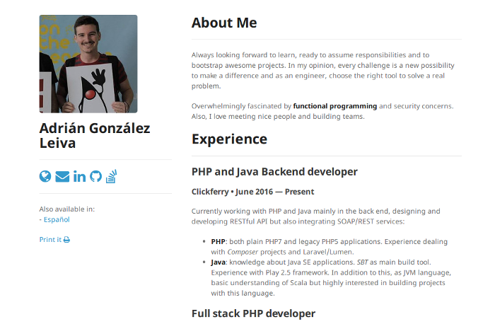

Minimal resume
===

This is intended to be a dead simple, data-isolated and multilingual resume.



## Roadmap

- [X] Data isolated
- [X] Multilingual
- [X] Show/hide personal photo
- [X] Contact data with icons
- [X] Printing (via dialog)
- [X] Markdown inside YAML files
- [ ] PR for colleague references

## How to customize your own

1. Fork this repository

```
https://github.com/soutoner/minimal#fork-destination-box
```

2. Customize `_config.yml`. It contains language-independent data and 
configuration setting about the resume. Don't forget to change:
    * Your `full_name`. This will be independent of the language.
    * `languages` if you want to restrict any language. If you want to add
    a new language please head [Adding a new language](#new-language).
    * `profile_photo` if you want to show a photo of you or not.
    * `profile_picture_path` if you want to change the path of the picture 
    or the file name. If you do not want to change this parameter,
    please upload a `profile.jpeg` to the `img/` directory with a size of `200x200`.
    * `contact` if you want to add links to your contact sites. Available:
        * Personal `website`.
        * `email`.
        * LinkedIn.
        * GitHub.
        * Stack Overflow.

3. Fill in your `en.yml` (or any other language) under `_data/`. This file
is divided in translations and the actual data of the resume. 

> Please remain the keys untouched so everything work as predefined.

## Further customization

Although it is a very simple structure it permits some more flexibility
that may not be so evident:

* Under `_includes/` you will have the different sections of the resume.
Feel free to create new sections. Remember that once created, you should
`include` them in the `index.md`.
* You can `include` different sections depending on the language, you
only have to play with the `include` statements in the `index.md`, 
`index_es.md` and so on.

## [](#new-language)Adding a new language

By default, the `index.md` page is set to English. 

The key point is the `lang` option of the [Front Matter](https://jekyllrb.com/docs/frontmatter/)
inside the pages of the root directory (i.e. `index.md`). This will define
the language for all the included data in your resume, so from this moment on,
Jekyll will now which data to include in your resume. You will only have
to elaborate the data in your preferred language.
 
```
# index.md

---
layout: default
lang: en
---
```

If you want to add a new language to the resume you only have to follow
this steps:

1. Choose your language (e.g. Spanish) and set a short code for it `es`.
 This is important as the code itself is not relevant but you must be consistent
 all over the project in order to successfully localize your resume.

2. Add your new language short code to the `languages` array inside `_config.yml`.

```
# _config.yml  
languages: [en, es]
```

3. Copy an already created translation file under `_data`, and while maintaining
the keywords, translate everything. This file holds translations that does
not belong to any section in particular.

```
$ cp _data/en.yml _data/es.yml
$ # Translate but maintain the keywords intact!!
```

4. Duplicate `index.md`. You can choose whatever name you want for this file
but you follow this guideline:
    * Keep it in the root of the project.
    * Set the `lang` variable in the [Front Matter](https://jekyllrb.com/docs/frontmatter/)
    to your selected short code (in this example `es`).
    * Set the `permalink` variable also to your short code. This will grant
    that your translation will be available under the (in this example) 
    `/es` path despite of the file name.
    
```
# index_es.md
---
layout: default
lang: es
permalink: es
---
```

## Special thanks to

* [Jekyll](https://jekyllrb.com/)
* [The Minimal Theme](https://github.com/pages-themes/minimal)
* [Making Jekyll multilingual - Sylvain Durand](https://www.sylvaindurand.org/making-jekyll-multilingual/)

## Forks & Contributions

Please feel free to fork this repository and create your own resume. Do not hesitate to open issues
or make PR if you have suggestions, doubts or improvements!

